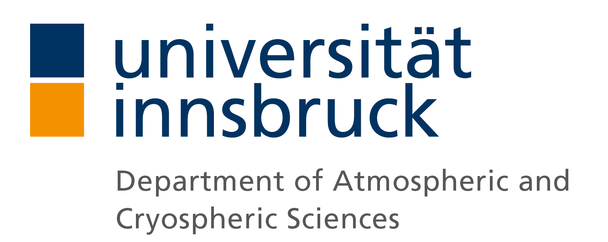

<footer role="contentinfo">
  

    
  

</footer>

I am an associate professor at the 
[Department of Atmospheric and Cryospheric Sciences](http://acinn.uibk.ac.at),
 part of the [Research Centre for Climate](https://www.uibk.ac.at/climate-cryosphere)
at the University of Innsbruck. In July 2023, I will move to
the [School of Geographical Sciences](http://www.bristol.ac.uk/geography), 
[University of Bristol](https://www.bristol.ac.uk).

I&#160;specialize in the study of our **climate system**, in particular 
its **atmosphere, cryosphere and how they interact**. 
I do this mostly with the help of computer models,
but I don't mind going to the field sometimes as well!

I am also active around the topics of **open science, open education, and open source**.
On this website you'll find infos and links to the projects I contribute to.

 
 

### Contact

I live in Innsbruck, Austria. When there isn't a global pandemic, you'll find me in my <a href="https://www.uibk.ac.at/acinn/people/fabien-maussion.html.en">office</a> at the usual
working hours.  Otherwise, you can reach me at <noscript>moc.liamg@reyohs</noscript>.

